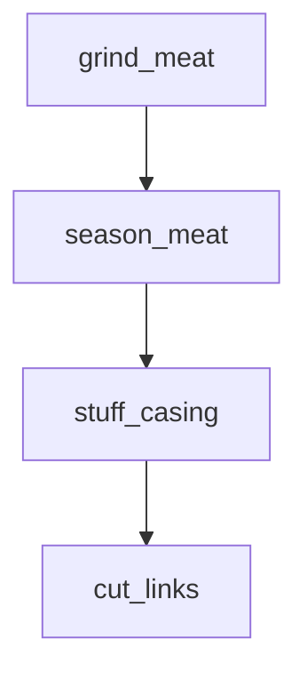
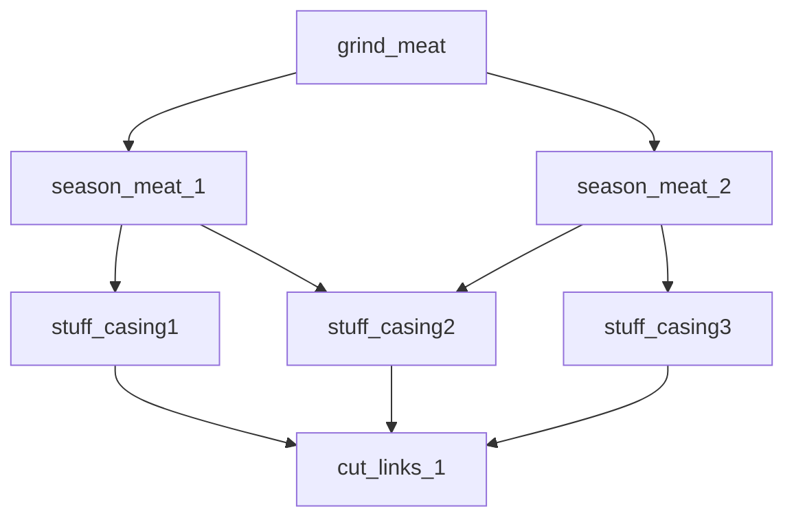
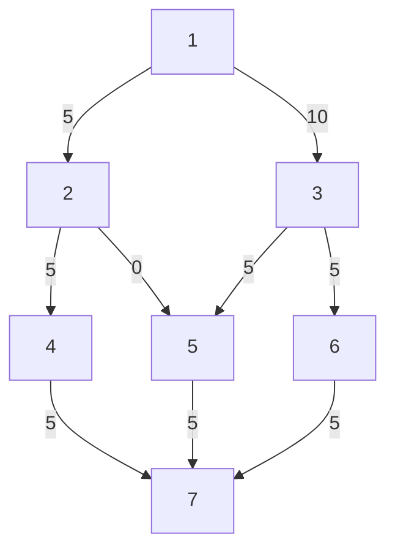

An old math problem I had not seen since my university days resurfaced the other 
day, the [**Maximum Flow problem**][1]. It came up in the context of analyzing 
some industrial process. For illustration purposes, let's say we are producing 
sausages, following these steps: we grind some meat, add some seasoning, then 
stuff and tie the sausage casings, and split them into delicious sausage links.  

We could represent this process as a graph, like so:



Now the question is, how many sausages per minute could we produce?  

Assuming each operation is performed by a separate person, this is not very 
complicated. We are going to be as slow as the slowest link. So if for instance 
we could  

- grind meat for 20 sausages / minute, 
- season meat for 15 sausages per minute,
- stuff 5 sausages per minute, and 
- cut 20 sausages per minute, 

we would end up running at 5 sausages / minute at best, the bottleneck being 
stuffing.  

Now we might be able to get a better throughput with some parallelization. For 
instance, we could organize production like so:  



This is still not overly complicated, but it is beginning to be hairy, and you 
can imagine how with a few more processes added, the question "how much work 
can I process through this network" will soon become impractical to handle by 
hand.  

This is essentially what the Maximum Flow problem is about. Given a directed 
graph, with capacity limitations, how much throughput (flow) can we achieve? 
In the rest of this post, I'll go through one way you could answer that 
question, using Linear Programming.

<!--more-->

## Representing the network

Let's start by representing our process as a network, with Nodes (each 
operation we need to perform) and their capacity, and Edges (how the operations
are connected sequentially).  

There are multiple representations we could take, we will go with this one:  

``` fsharp
type NodeID = | NodeID of int

type Node = { Capacity: float }

type Edge = {
    Orig: NodeID
    Dest: NodeID
    }
    with
    member this.Name = $"{this.Orig}-{this.Dest}"

let edge (node1, node2) = { Orig = node1; Dest = node2 }
```

Armed with this, we can now represent our sausage factory:  

``` fsharp
let nodes =
    [
        // Grinder
        NodeID 1, { Capacity = 20.0 }
        // Seasoning
        NodeID 2, { Capacity = 15.0 }
        NodeID 3, { Capacity = 15.0 }
        // Stuffing
        NodeID 4, { Capacity = 5.0 }
        NodeID 5, { Capacity = 5.0 }
        NodeID 6, { Capacity = 5.0 }
        // Links
        NodeID 7, { Capacity = 20.0 }
    ]
    |> Map.ofList

let network = [
    edge (NodeID 1, NodeID 2)
    edge (NodeID 1, NodeID 3)
    edge (NodeID 2, NodeID 4)
    edge (NodeID 2, NodeID 5)
    edge (NodeID 3, NodeID 5)
    edge (NodeID 3, NodeID 6)
    edge (NodeID 4, NodeID 7)
    edge (NodeID 5, NodeID 7)
    edge (NodeID 6, NodeID 7)
    ]
```

## Setting up the MaxFlow problem as a Linear Programming problem

Now that we have a network, let's see how much flow we can push through it.  

We are trying to push as much as possible through each edge, under 2 
constraints:

- Capacity: we cannot push more to a node that it can handle,
- Conservation: the total flow that enters a node must exit that node.

The conservation constraint has a caveat: it does not apply to a Source or a 
Sink. Nodes that have no predecessor (Sources) receive no flow, and nodes that 
have no successors (Sinks) have no flow out.

Let's setup that problem as a linear programming one, using the 
[**Google OR Tools library**][2], by first loading the package in our script:  

``` fsharp
#r "nuget: Google.OrTools, 9.8.3296"
open Google.OrTools.LinearSolver
```

Our first step will be to instantiate a solver:

``` fsharp
let solver = Solver.CreateSolver("GLOP")
```

Our variables here will be the flow that goes through each edge. Let's create 
one variable per edge, which must be a positive number:  

``` fsharp
let variables =
    network
    |> List.map (fun edge ->
        let var = solver.MakeNumVar(0.0, infinity, edge.Name)
        edge, var
        )
    |> Map.ofList
```

Here I create one variable per edge. Each variable can take any value between 
0 and +infinity. For convenient manipulation later, I add them all into a map.

Let's tackle the Capacity constraint next, which we can express as follows: 
for any node, the total flow of edges that enter the node must be less than its 
capacity:  

``` fsharp
nodes
|> Map.iter (fun nodeID node ->
    let capacityConstraint = solver.MakeConstraint($"CAPACITY {nodeID}")
    capacityConstraint.SetBounds(0.0, node.Capacity)
    network
    |> List.filter (fun edge -> edge.Dest = nodeID)
    |> List.iter (fun edge ->
        capacityConstraint.SetCoefficient(variables.[edge], 1.0)
        )
    )
```

Here I create a constraint for each node, taking every edge that enters that 
node by filtering the edges first, and summing up the flow going through each 
of these edges (`variable.[edge]`).

Almost there! We just have the Conservation constraint left. For each node that 
has edges coming in and exiting, the flow entering must equal the flow exiting. 
Let's go:  

``` fsharp
nodes
// keep only nodes that have incoming and outgoing edges
|> Map.filter (fun nodeID _ ->
    network
    |> List.exists (fun edge -> edge.Dest = nodeID)
    &&
    network
    |> List.exists (fun edge -> edge.Orig = nodeID)
    )
|> Map.iter (fun nodeID node ->
    let capacityConstraint = solver.MakeConstraint($"CONSERVATION {nodeID}")
    capacityConstraint.SetBounds(0.0, 0.0)
    // incoming flow
    network
    |> List.filter (fun edge -> edge.Dest = nodeID)
    |> List.iter (fun edge ->
        capacityConstraint.SetCoefficient(variables.[edge], 1.0)
        )
    // outgoing flow
    network
    |> List.filter (fun edge -> edge.Orig = nodeID)
    |> List.iter (fun edge ->
        capacityConstraint.SetCoefficient(variables.[edge], -1.0)
        )
    )
```

Here, rather than stating "flow in = flow out", we re-arrange into an 
equivalent expression, "flow in - flow out = 0".  

## Solving the MaxFlow problem with Linear Programming

We have variables, we have constraints - all that is left to do is ask the 
solver to perform its magic and find optimal values for the variables:  

``` fsharp
let objective = solver.Objective()
objective.SetMaximization()

variables
|> Map.iter (fun _ variable ->
    objective.SetCoefficient(variable, 1.0)
    )

let solution = solver.Solve()
```

Which produces the following result:

```
val solution: Solver.ResultStatus = OPTIMAL
```

We have an optimal solution! But what is that solution? Let's inspect the 
variable values:  

``` fsharp
variables
|> Map.iter (fun edge var ->
    let flow = var.SolutionValue()
    printfn $"{edge.Orig} - {edge.Dest}: {flow}"
    )
```

Which produces the following results:

```
NodeID 1 - NodeID 2: 5
NodeID 1 - NodeID 3: 10
NodeID 2 - NodeID 4: 5
NodeID 2 - NodeID 5: 0
NodeID 3 - NodeID 5: 5
NodeID 3 - NodeID 6: 5
NodeID 4 - NodeID 7: 5
NodeID 5 - NodeID 7: 5
NodeID 6 - NodeID 7: 5
```

Can we visualize this as a graph? Sure we can, let's convert this into a 
quick-and-dirty mermaid chart:  

``` fsharp
variables
|> Seq.map (fun kv ->
    let edge = kv.Key
    let var = kv.Value
    let flow = var.SolutionValue()
    let (NodeID orig) = edge.Orig
    let (NodeID dest) = edge.Dest
    $"{orig}-- {flow} -->{dest}"
    )
|> String.concat ";\n"
|> fun graph ->
   $"```mermaid
graph TD;
{graph}
```"
```

... which produces the following visual representation of our solution:  



## Conclusion

Here you have it, one way to solve the MaxFlow problem, using Linear 
Programming. This exercise reminded me of why I enjoy Linear Programming so 
much. The hard work is figuring out exactly what the problem is and how to 
state it, once that is done, the work is done. We don't have to worry about the gory details of how to actually solve it, that is the solver job.  

As a side note, the problem I solved here is a slight variation of the Max Flow 
problem. The canonical problem has capacity constraints on the edges and not 
the nodes, but they are fundamentally the same.  

Two final comments before closing shop for today. First, and I have not checked 
this, I think the approach would also work for a network with loops or even 
entirely closed, or a network with multiple Sources and Sinks. Then,   interestingly, while we have an explicit solution to the problem, we do not 
have a direct answer to the original question, namely "what is the total flow 
we can push through this network". To answer that question, you would have to 
compute the total flow in across all Sinks, or the total flow out across all 
Sources. This still leaves open one weird edge case - closed circuits.  

Anyways, that's it for today!

[1]: https://en.wikipedia.org/wiki/Maximum_flow_problem
[2]: https://developers.google.com/optimization/
