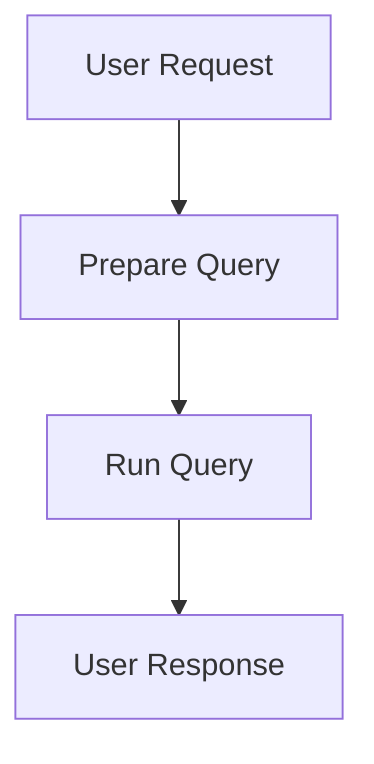
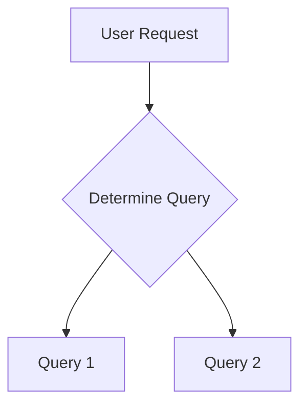
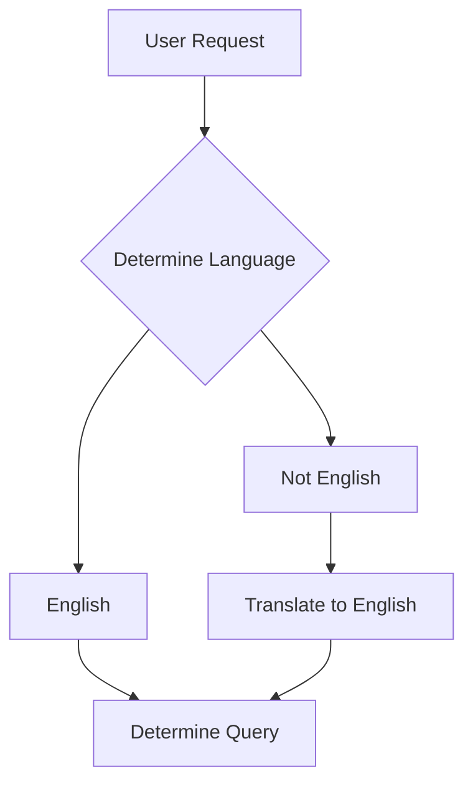

For many reasons, I am not a fan of the current hype around Large Language 
Models (LLMs). However, a few months ago, I was asked to work on a project to 
evaluate using LLMs for a practical use case. I figured this would be an 
interesting opportunity to see by myself what worked and what didn't, and 
perhaps even change my mind on the overall usefulness of LLMs.  

In this post, I will go over some of the things I found interesting.  

Caveat: I have a decent knowledge of Machine Learning, but this was my first 
foray into LLMs. As a result, this post should not be taken as competent 
advice on the topic. It is intended as a beginners' first impressions.  

## Context

The client - let's call them ACME Corp - produces and distributes many products 
all over the world. Plenty of useful information about these products, such as 
inventory or shipments, are available in a database. Unfortunately, most 
employees at ACME Corp have neither access nor a good enough grasp of SQL (or 
of the database itself) to make use of that information.  

The thought then was to explore if, by using LLMs, we could give users a way to 
access that information, in their own language ("what is the current inventory 
of sprockets model 12345 in Timbuktu"), without the hurdle of writing complex 
SQL queries. And, because ACME Corp is international, "in their own language" 
is meant quite literally: the question could be asked in English, as well as in 
a wide range of other languages.  

At a high level, we want something like this:  



Given the time budget on the project, we did not have the option to fine-tune a 
model for our domain, and used a "stock" LLM.  

<!--more-->

## SQL Injection As A Service

One decision we took early on was to not let the LLM write SQL Queries. The 
concern here was two-fold. First, the target database is complex, and without 
providing a lot of context to the LLM, we did not believe it could generate 
reasonable queries. Second, we were concerned about how wrong things could go, 
if we let users essentially run arbitrary SQL queries, potentially creating a 
[`Little Bobby Tables`][1] situation.  

Instead, we decided to run pre-written queries. This reduces the risks, but 
also the usefulness of the system, because only a limited set of queries is 
supported.  

This approach makes the task simpler: assuming for a minute that we know the 
query is about inventory levels, given a user request like, say:  

```
what is the current inventory of sprockets model 12345 in Timbuktu
```

... we need to extract 2 pieces of information only:

- ProductID: 12345
- Location: Timbuktu

... which we can then use to run a query along the lines of, say:  

```
SELECT InventoryLevel
FROM Inventory
WHERE ProductID = '12345'
AND Location = 'Timbuktu'
```

## Stringly Typed Code

So how can we extract the 2 relevant pieces of information from the message? 
This is where we used the LLM, with prompts along the lines of:  

```
In the following message, find the product number and location.  
Write the product number on one line and the location on one line, 
and nothing else.
Message: { message goes here }
```

This approach worked pretty well, with some caveats. One thing that 
proved challenging was getting outputs that were formatted consistently. From 
one run to the next, we would get results like this:  

```
12345
Timbuktu
```

... but also, less often, perhaps like this:  

`Product: 12345, Location: Timbuktu`  

From the perspective of a human, both of these results are equally good. 
From a code standpoint, either would be fine, as long as the same prompt 
consistently produced results formatted the same way.  

In our experience, achieving that type of consistency has been a challenge. 
Practically, this meant that quite a bit of code needed to be written to 
validate what came out of the LLM, and compensate for inconsistent formatting - 
hello Regex my old friend!  

This strikes me as a general problem to integrate LLMs in a larger workflow. In 
the end, the LLM is a black box, which exposes a single function: it takes in a 
string, and returns a string. A typical workflow will involve steps that 
executes a piece of code, and 
require some set of arguments, with well-defined types (int, date, ...). 
Without a reliable way for an LLM to produce structured outputs, it will be up 
to the developers to validate these outputs and convert them into the expected 
shape.  

To be fair, the fact that extracting potential parameters from a piece of text 
worked was fairly impressive. It is also something that would have been very 
difficult to achieve without a LLM, especially in the context of requests that 
could be written in different languages. The surprising part was how it was 
possible to achieve something fairly complex with very limited effort, but it 
wasn't possible to achieve something comparatively much simpler (format the 
responses consistently).  

## Selecting an Option

In the example above, I assumed that we knew what the intented query was. This 
is not the case in general: we need to determine what query is relevant, given 
the user request.  



Our strategy here was to use the LLM to make that determination, with prompts 
along the lines of  

```
Which option best describes the following message:  
Option 1: inventory for a product  
Option 2: shipment to a location  
Write the best option, and nothing else.  
```

Unsurprisingly, we ran into the same problem as with the parameters extraction. 
Getting usable, consistently formatted responses was a challenge, and required 
quite a bit of string fiddling.  

Another thing I wish could be surfaced was any form of feedback on how reliable 
the decision was. What if there is no good option? What if 2 options seem a 
plausible fit, but it is difficult to decide which?  

With a traditional Machine Learning model, you would get 
a probability distribution over the alternatives, because you would have 
explicitly trained a model to classify between these alternatives. Using an LLM 
for that task means re-applying a model that was trained to generate plausible 
text, and hope that it somehow works on your problem, too.  

This also strikes me as a problem, because most non-trivial business workflows 
will contain some form of automated decision making, and a stock LLM does not 
seem well-suited for that task.  

## Reliability and Testing

Following the same train of thought, the response of a LLM is not 
deterministic. Running the same exact prompt multiple times is not guaranteed 
to produce the same results. This creates an issue: instead of a binary test 
(a feature works, or it doesn't), we need to fall back to weaker statements 
(how often does the feature work as expected).  

Our strategy here was to write a validation harness, using labeled examples. 
Instead of running the test once, we ran it numerous times, measuring the 
proportion of correct answers. As an example, we could validate the extraction 
of the product ID like this:  

```
message: what is the current inventory of sprockets model 12345 in Timbuktu
expected: 12345
prompt: { insert prompt here}
```

Run the prompt 100 times, check how many times you get the expected answer, and 
you have a reliability measurement.  

This is not a particularly novel idea: this is how you would go about 
validating a Machine Learning model in general. This allowed us to quantify how 
good a prompt was, and gave us a benchmark to compare prompt variations. 
Instead of anecdotal evidence ("I tried this prompt once and it seemed to 
work"), we could compare different prompts on the same task, and evaluate 
how much better (or worse...) they actually were.  

## Languages

So far, I focused on the parts that I found problematic. One positive surprise 
was how well a LLM handled different languages.  

One goal was to accept requests in a variety of languages, and not just 
English. Our initial thought was to reduce everything to English, like so:  



This is obviously fraught with issues, because we introduce a 
[Telephone Game][2] in our workflow. Unsurprisingly, the results were not very 
good, so we decided to try to bypass the translation step entirely, asking 
**in English** what the request was about, regardless of the language it was 
written in. And... it worked! Or, more accurately, it worked much better.  

In hindsight, this makes sense. A LLM is trained on many pieces of text, and 
what language they are written in is not directly relevant. What matters is 
the tokens and their relationships, as observed in the training corpus. 
Thinking in terms of translation was me projecting how I think of documents and 
languages.  

Anyways, the ability to skip translation and directly work off a piece of text 
in your own language, regardless of what the text is written in, is pretty 
powerful.  

As a side benefit, skipping the translation was helpful in reducing the overall 
number of steps in the process. Any step in the workflow that can fail will 
mechanically increase the overall probability of failure, so the less steps, 
the better!  

## Parting thoughts

Overall, this experiment did not change my mind. What Large Language Models do 
is very impressive, but I find their usefulness limited, at least for my use 
cases. A LLM is fundamentally a black box that converts a string to a string, 
and does not offer much in terms of expressing a domain model. As a result, 
integrating a LLM in a workflow that involves interactions with code will 
require manual work to make sure the LLM output is converted to parameters that 
can be consumed downstream.  

Stated differently, I can see their usefulness in scenarios where the inputs 
are text, and a human will supervise the process. Without fine-tuning a LLM 
for a specific domain task, a LLM can be useful in specific situations, and 
perform tasks that would be difficult to achieve writing code manually, but at 
a cost. If getting the correct answer reliably is important, 
a "stock" LLM will not be ideal. It can do complicated things easily, but 
in my limited experience, getting consistent, reliable results is hard.  

Part of me believes that the appeal of LLMs is the old desire to be able to 
write code without having to deal with developers. Instead of going through a 
slow design and development process, just tweak a few prompts, and voilà! It 
works. However, in our example, most of the issues I described could be 
resolved with a different approach. Instead of letting a LLM try to figure out 
the topic or parameters, the user could be presented with a basic user 
interface to make these choices. This would be both be entirely reliable, and 
fairly cheap to implement.  

One place where I can imagine a LLM being powerful in this case is generating 
a SQL query. However, doing that in an automated fashion is very dangerous. I 
can see that direction being viable as an assistant for a user who already has 
some knowledge of SQL (and can decide if a Query is plausible or dangerous), 
focusing less on the SQL part, and more with navigating a complex schema.  

I suspect most of the problems I mentioned could be adressed by fine-tuning a 
LLM for the task at hand. This is arguably as complicated as writing code, but 
this would perhaps address another general issue I have with using a "stock" 
model. One definition of Machine Learning is as a program that 
learns, that is, that becomes mechanically better at performing a task as more 
data becomes available. When using a pre-existing LLM for a task, there is no 
learning whatsoever. If we keep using the same LLM, our workflow will see no 
improvements over time.  

[1]: https://xkcd.com/327/
[2]: https://en.wikipedia.org/wiki/Telephone_game